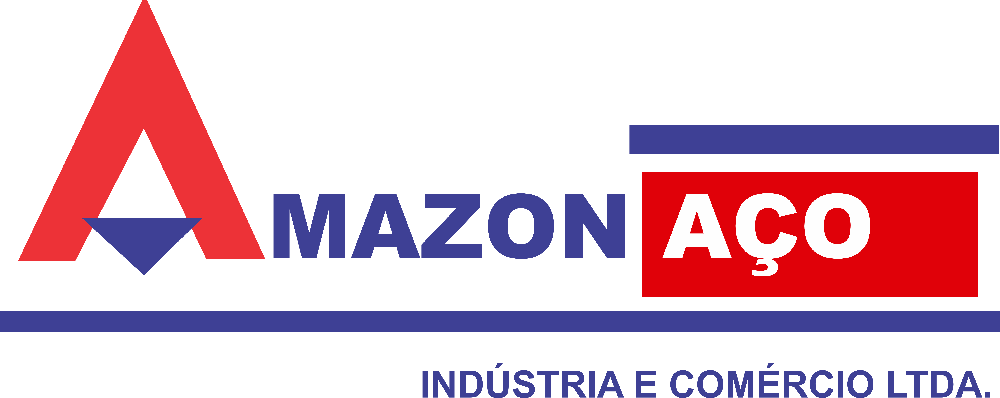

<p align="center">
  
</p>

<h1 align="center">Portal WMS & Controle de Estoques — Amazon Aço</h1>

<p align="center">
  <strong>Plataforma corporativa de auditoria em tempo real, inventário rotativo, rastreabilidade FEFO e controle operacional multidepósitos.</strong>
</p>

<p align="center">
  <a href="https://cdiangell-dei.github.io/portal-estoque/"></a>
  
  
  
  
</p>

<div align="center">

### 🚀 [Acessar Portal em Produção (GitHub Pages)](https://cdiangell-dei.github.io/portal-estoque/)

</div>

---

## 📌 Visão Geral

O **Portal de Controle de Estoques da Amazon Aço** foi desenvolvido para atender à demanda de conferência, acuracidade e controle operacional das 7 unidades/filiais do grupo. A aplicação opera diretamente na nuvem, com suporte offline/PWA de alta performance para coletores de dados, smartphones de campo e computadores de almoxarifado e auditoria.

### 🌟 Destaques da Plataforma
- **Zero Instalação de Servidor Local:** Funciona 100% no navegador (Web & Mobile), sem necessidade de instalação de dependências locais (Node.js/Git) nas estações de trabalho.
- **PWA Instalável:** Pode ser adicionado à tela inicial de smartphones Android/iOS ou como aplicativo de desktop no Chrome/Edge.
- **Teclado & Calculadora Adaptativos:**
  - **No Celular:** Teclado virtual touch otimizado para lançamentos numéricos rápidos em campo.
  - **No Computador:** Ocultação automática da calculadora virtual touch, com suporte a cálculos diretos no teclado físico (ex: `10+25*2` + `Enter`).
- **Acuracidade Inteligente para Saldo Zero:** Itens com saldo de sistema zerado são pré-validados como acurados virtualmente, permitindo auditorias focadas e relatórios limpos.
- **Dark Mode Siderúrgico:** Tema visual escuro (Grafite Aço Naval) ergonomicamente desenhado para ambientes industriais e uso noturno.

---

## 🧩 Módulos do Sistema

| Módulo | Arquivo Principal | Descrição & Funcionalidades |
| :--- | :--- | :--- |
| **Inventário Rotativo** | [`inventario.html`](inventario.html) | Contagem cega por filial e almoxarifado, cálculo automático de divergências, conferência física e auditoria de acuracidade em tempo real. |
| **Transferências Rápidas** | [`transferencia.html`](transferencia.html) | Movimentações entre depósitos e filiais com suporte a leitor de código de barras e QR Code via câmera integrada. |
| **Controle de Validades (FEFO)** | [`validade.html`](validade.html) | Rastreabilidade de lotes de insumos químicos, tintas e abrasivos com método FEFO (*First Expire, First Out*) e semáforo visual de criticidade. |
| **Kardex de Auditoria** | [`kardex.html`](kardex.html) | Histórico imutável de movimentações, entradas, saídas e ajustes de saldo por operador com carimbo de data/hora. |
| **Gestão de EPIs & Luvas** | [`luvas.html`](luvas.html) | Controle de distribuição e consumo de equipamentos de proteção individual por colaborador e setor fabril. |
| **Minutas de Carregamento** | [`minutas.html`](minutas.html) | Romaneio e acompanhamento logístico de separação e expedição de pedidos. |
| **Solicitação de Materiais** | [`solicitacao_estoque.html`](solicitacao_estoque.html) | Requisições internas de insumos entre setores fabris e o almoxarifado central. |
| **Painel de Controle / BI** | [`index.html`](index.html) | Dashboard executivo com métricas de acuracidade, gráficos analíticos (Chart.js), alertas críticos e atalhos rápidos. |
| **Administração** | [`admin.html`](admin.html) | Gestão de permissões de operadores, auditores e supervisores de estoque. |

---

## 🏢 Unidades Operacionais (Filiais)

O sistema suporta segregação e visualização unificada de dados entre as unidades:

```
[00] Matriz Manaus        ─── Almoxarifado Central & Vendas
[01] Centro de Distribuição─── Pulmão Logístico & Carregamento Pesado
[02] Unidade Fabril       ─── Perfilados, Telhas e Chapas
[04] Filial Distribuição  ─── Varejo & Atacado Regional
[05] Beneficiamento & Corte── Almoxarifado Técnico & Insumos Especiais
[06] Filial Estratégica   ─── Apoio Logístico Integrado
[12] Nova Unidade         ─── Expansão Operacional
```

---

## 🛠️ Stack Tecnológica

- **Frontend Core:** HTML5 semântico, JavaScript moderno (ES6+ modular).
- **Estilização & Design System:** [Tailwind CSS](https://tailwindcss.com/) com paleta corporativa oficial da Amazon Aço (Azul Marinho `#002f6c`, Vermelho `#B40D15` e Superfície Siderúrgica).
- **Ícones & Componentes:** [Lucide Icons](https://lucide.dev/).
- **Business Intelligence & Gráficos:** [Chart.js](https://www.chartjs.org/).
- **PWA & Offline:** Service Worker (`service_worker_pwa.js`) com cache de ativos e Web App Manifest (`manifest.json`).
- **Banco de Dados & Nuvem:** [Supabase](https://supabase.com/) (PostgreSQL gerenciado, Row Level Security, WebSockets realtime).
- **Hospedagem & CDN:** [GitHub Pages](https://pages.github.com/) e [Cloudflare Pages](https://pages.cloudflare.com/) com alta disponibilidade global.

---

## 📱 Instalação como Aplicativo (PWA)

### No Smartphone (Android / iOS)
1. Acesse o portal: [https://cdiangell-dei.github.io/portal-estoque/](https://cdiangell-dei.github.io/portal-estoque/)
2. No menu do navegador (três pontos no Chrome ou botão de compartilhar no Safari):
3. Selecione **"Adicionar à tela inicial"** ou **"Instalar aplicativo"**.
4. O app será executado em modo tela cheia, com ícone dedicado e alto desempenho.

### No Computador (Desktop)
1. Abra o link no **Google Chrome** ou **Microsoft Edge**.
2. Clique no ícone de **Instalar** localizado na extremidade direita da barra de endereços (ou no banner exibido no portal).
3. O portal passará a rodar como uma janela nativa do Windows.

---

## 📁 Estrutura do Repositório

```text
portal-estoque/
├── index.html                 # Dashboard principal & BI executivo
├── inventario.html            # Interface de inventário e contagem
├── inventario.js              # Lógica de acuracidade, saldo 0 e filtros
├── transferencia.html         # Módulo de transferências & leitor de código
├── validade.html              # Módulo de controle de validades FEFO
├── validade.js                # Lógica e regras de semáforo de validade
├── kardex.html                # Consulta de histórico e auditoria
├── luvas.html                 # Gestão de EPIs e luvas
├── minutas.html               # Minutas de carga e romaneios
├── solicitacao_estoque.html   # Solicitações internas de materiais
├── admin.html                 # Painel de controle de usuários
├── shared.js                  # Conexão Supabase, utilitários e autenticação
├── manifest.json              # Manifesto PWA
├── service_worker_pwa.js      # Service Worker para suporte PWA
├── logo_amazon_aco.png        # Logo corporativo
├── icon.png                   # Ícone do aplicativo
└── README.md                  # Documentação do projeto
```

---

## 🔄 Fluxo de Deploy e Atualização

As atualizações enviadas para a branch `main` são publicadas de forma automática pelo pipeline do GitHub Pages e Cloudflare Pages:

```bash
# 1. Realizar alterações necessárias
git add .

# 2. Criar o commit com descrição das melhorias
git commit -m "feat: melhorias no modulo de inventario"

# 3. Enviar para producao
git push origin main
```

---

<p align="center">
  <strong>Amazon Aço — Tecnologia e Eficiência na Gestão de Estoques</strong><br>
  <sub>Desenvolvido para uso interno das unidades operacionais.</sub>
</p>
